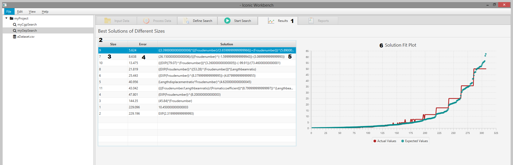
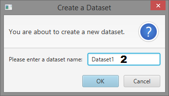
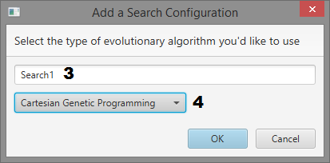
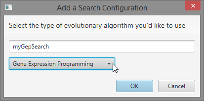
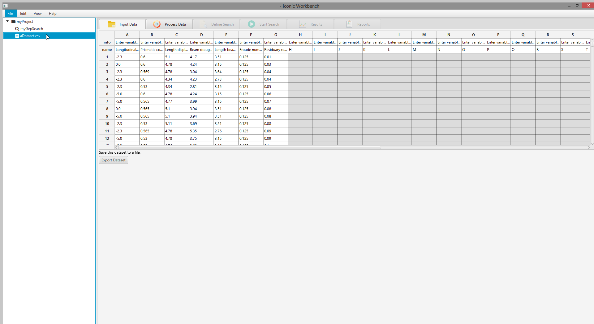
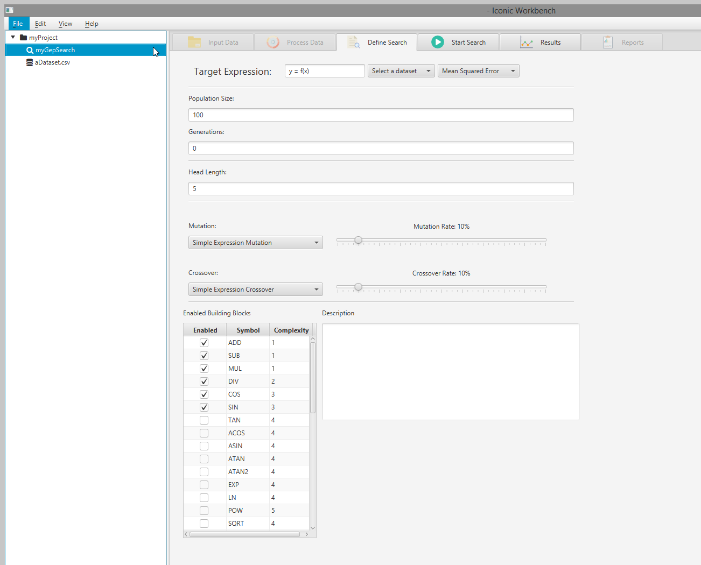
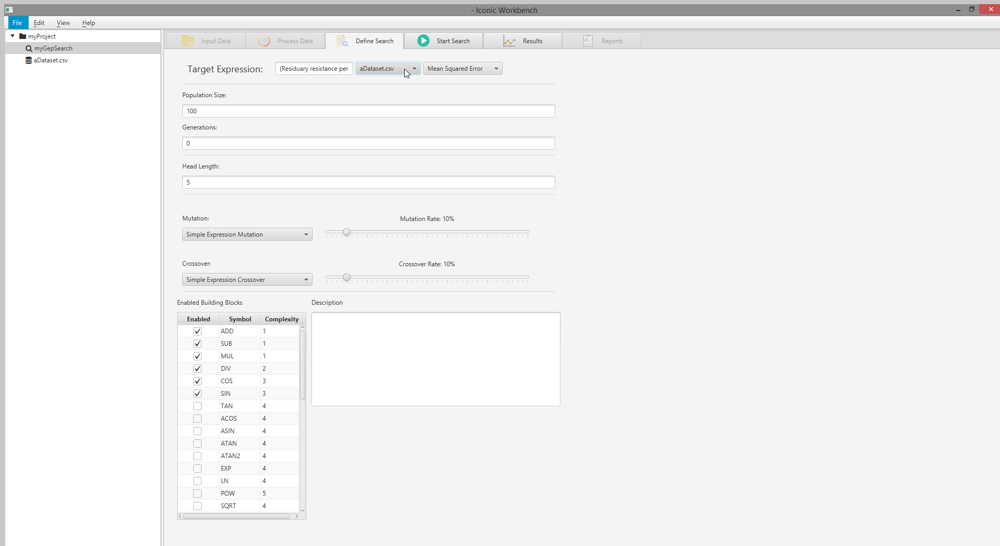
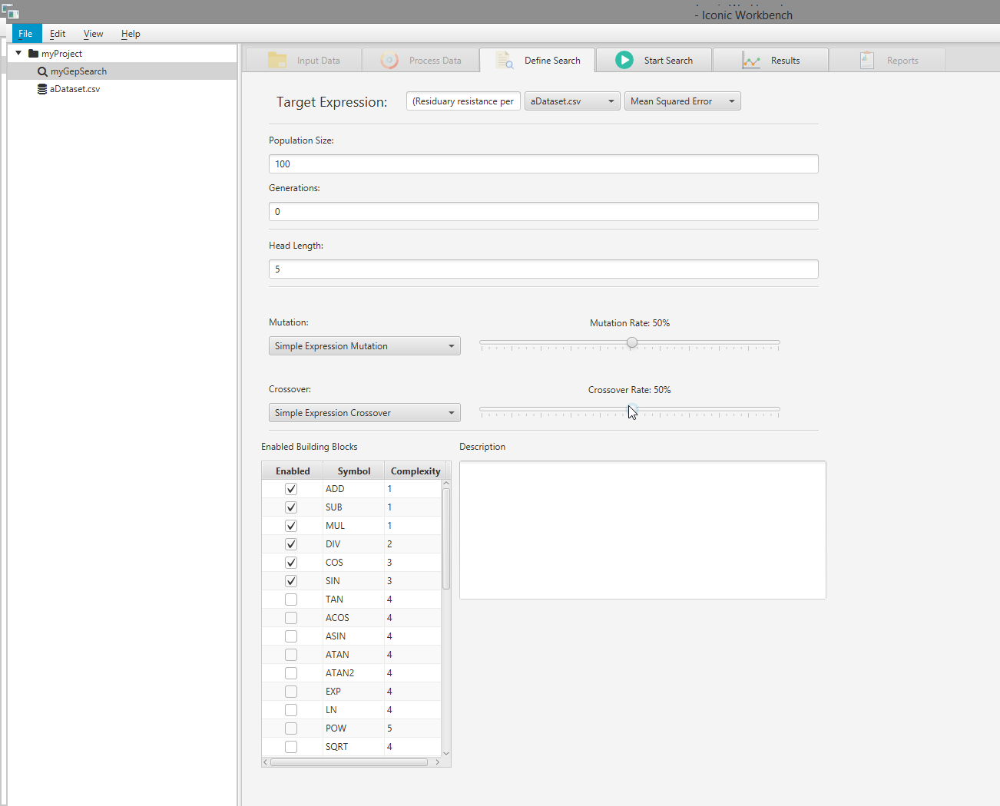
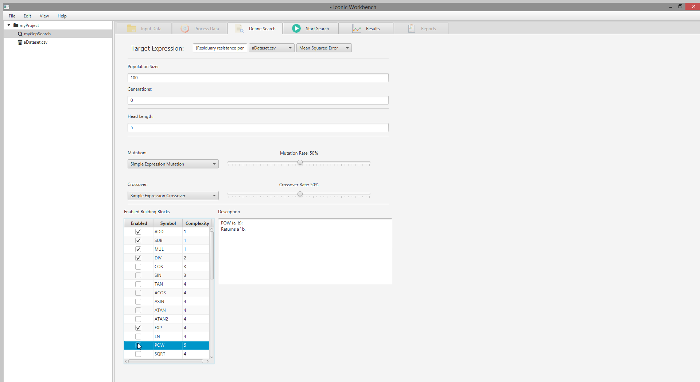
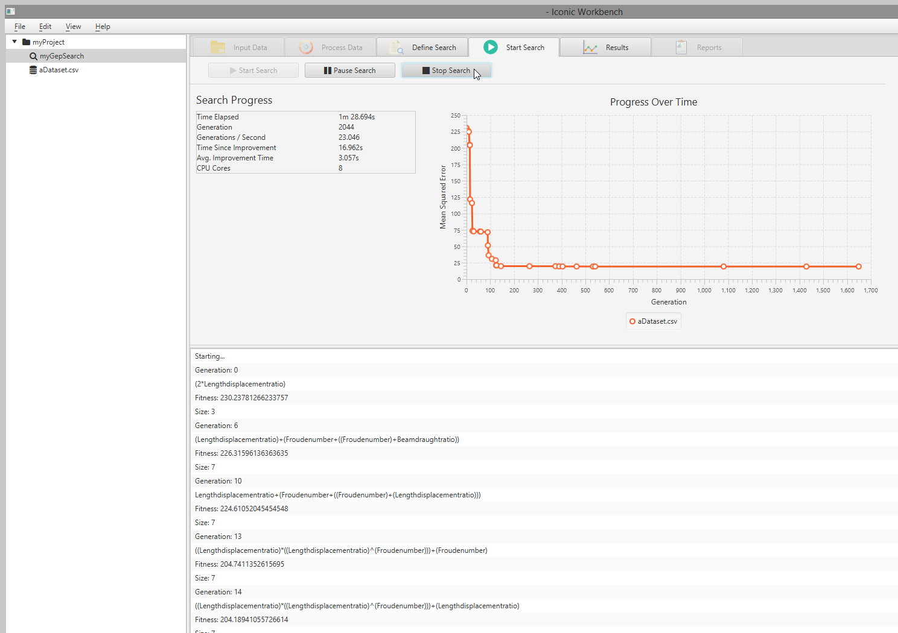

# Iconic
## User Manual
- Version 1.5
- 29/10/2018
- Document Number: 1.0

 
## Table of Contents
1. [Introduction](#introduction)
2. [Overview](#overview)
    1. [Conventions](#conventions)
    2. [Cautions & Warnings](#cautions-warnings)
3. [Getting Started](#getting-started)
    1. [Set-up Considerations](#set-up-considerations)
    2. [User Access Considerations](#user-access-considerations)
    3. [Accessing the System](#accessing-the-system)
    4. [System Organization & Navigation](#system-organization-navigation)
    5. [Exiting the System](#exiting-the-system)
4. [Using the System](#using-the-system)
    1. [Load, View, & Edit a Dataset](#load-view-edit-a-dataset)
    2. [Pre-Process Data](#pre-process-data)
    3. [Define Search](#define-search)
    4. [Start Search](#start-search)
    5. [Results](#results)
    6. [<Given Function/Feature>](#given-function-feature)
    7. [<Given Sub-Function/Sub-Feature>](#given-sub-function-sub-feature)
5. [Using the Command-Line](#using-the-command-line)
    1. [Available Options](#available-options)
        1. [Cartesian Genetic Programming](#cartesian-genetic-programming)
        2. [Gene Expression Programming](#gene-expression-programming)
    2. [Loading a Dataset](#loading-a-dataset)
    3. [Pre-Processing a Dataset](#pre-processing-a-dataset)
    4. [Preparing a Chromosome Supplier](#preparing-a-chromosome-supplier)
    5. [Preparing an Evolutionary Algorithm](#preparing-an-evolutionary-algorithm)
    6. [Starting a Search](#starting-a-search)
    7. [Gathering the Results](#gathering-the-results)
6. [Troubleshooting & Support](#troubleshooting-support)
    1. [Error Messages](#error-messages)
    2. [Special Considerations](#special-considerations)
    3. [Support](#support)
7. [Appendix](#appendix)
    1. A: Record of Changes
    2. B: Acronyms
    3. C: Glossary
    4. D: Referenced Documents
    5. E: Approvals
    6. F: Additional Appendices
    7. G: Notes / Instructions

## Introduction
*Instructions: Provide full identifying information for the automated system, application, or situation for which the User Manual applies, including as applicable, identifications number(s), title(s)/name(s), abbreviation(s)/acronym(s), part number(s), version number(s), and release number(s). Summarize the purpose of the document, the scope of activities that resulted in its development, the intended audience for the document, and expected evolution of the document. Also describe any security or privacy considerations associated with use of the User Manual.*

This User Manual (UM) provides the information necessary for users to effectively use the **Iconic Workbench**.  It is up-to-date as of Iconic v0.6.0 released 26/10/2018.

## Overview
*Instructions: Briefly describe in general terms the system/application and the purpose for which it is intended, written in non-technical terminology. Consider including a high-level, business context diagram(s) for the system. The description should include, but is not limited to, the following:*
- *Key features or major functions performed by the system/application*
- *Architecture of the system in non-technical terms (e.g., client server, Web-based, etc.)*
- *User access mode (e.g., graphical user interface)*
- *System environment or special conditions*

The **Iconic Workbench** provides a graphical user interface over the Iconic API. It allows users to easily import and modify datasets, preprocess data and start evolutionary searches to find an expression which represents the data. The Iconic Workbench aims to provide users an easy way to generate predictive models for their data.

The key features it provides are:
* Two evolutionary algorithms
    * Cartesian Genetic Programming
    * Gene Expression Programming
* Modifiable search parameters
* Import, modify and export datasets all within the application
* Preprocess data with a variety of functions such as normalise and smooth
*

### Conventions
*Instructions: If applicable, describe any stylistic and command syntax conventions used within the User Manual. The following text is provided as an example only.*

This document provides screen prints and corresponding narrative to describe how to use the **Iconic Workbench**. It will describe general usage of the application in the Getting Started section.

The term ‘user’ is used throughout this document to refer to a person who requires and/or has acquired access to the **Iconic Workbench**.

### Cautions & Warnings
*Instructions: If applicable, identify any cautions or warnings that the user should know about before using the system (e.g., noted prohibitions, penalties for unauthorized access, etc.). If waiver use or copy permissions need to be obtained, describe the process.*

## Getting Started
*Instructions: Provide a general walkthrough of the system from initiation through exit. The logical arrangement of the information should enable the user to understand the sequence and flow of the system. Use screen prints to depict examples of text under each heading.*
Below is an overview of each of the screens in the Iconic Workbench, followed by a short guide on how to run your first search.

### Set-up Considerations

Java Runtime Environment version 8 or higher must be installed to use the Iconic Workbench. It can be downloaded 

To optimize utilisation of the **Iconic Workbench**:
1. Use Java version 8.0 or higher.
2. Screens are designed to be viewed at a screen resolution of 1920 x 1080.

### Screens
#### Input Data

1. Project tree
2. Searches in the project
3. A dataset in the project
4. The Input Data tab
5. Create Dataset button
6. Import Dataset button
7. Create New Search button

8. Information/Description row of the spreadsheet view
9. Feature name/Header row
10. First row of data in the dataset
11. Export Dataset/Save button

#### Process Data

1. Process Data tab
2. List of dataset features
3. Smooth data
4. Handle missing values
5. Normalise
6. Remove outliers
7. Offset values
8. Plot of data points

 9. Smoothing window input
 10. Missing values method dropdown
 11. Min and Max scale input
 12. Outlier Threshold input
 13. Offset value input
 14. Preprocessor order of operations

#### Define Search

1. Define Search tab
2. Target expression input
3. Dataset selection dropdown
4. Error metric dropdown
5. Population size input
6. Number of generations input
7.  Number of outputs input
8. Number of columns input
9. Number of rows input
10. Number of levels back input
11. Mutation algorithm dropdown
12. Mutation rate slider
13. Building block display
14. Enable building block checkbox
15. Building block symbol
16. Building block complexity
17. Building block description

18. Head length input
19. Crossover algorithm dropdown
20. Crossover rate slider

#### Start Search

1. Start Search tab
2. Start search button
3. Pause search button
4. Stop search button
5. Search information display
6. Progress over time chart
7. Search console log

#### Results

1. Results tab
2. Results table
3. Size of solution
4. Error of solution
5. Solution expression
6. Solution fit plot

#### Dialogs

1. Project name input

2. Dataset name input

3. Search name input
4. Search type selection dropdown

### Running a search
Below is a simple start to finish guide to running a search.

1. Start the Iconic Workbench
2. Click the "Import Dataset" button

3. Navigate to and select a dataset, click "Open"

4. Enter a name for your project and click "OK"

5. Enter a search name, select a search and click "OK"
*Note: This guide uses the "Gene Expression Programming" search type*

6. Select the dataset in the project tree to view the data
*Note: You may edit the data by double-clicking a cell, entering a new value and pressing enter*

7. With the dataset selected, click the "Process Data" tab to view and process each feature individually
*Note: You may click individual features to plot them and apply preprocessing transformations on this screen*

8. Select the search in the project tree, then select the "Define Search" tab
*Note: You may define search parameters on this screen. Besides selecting the dataset to use, modifying search parameters is optional*

9. Select a dataset from the dropdown menu
*Note: Selecting a dataset with missing values will give a warning. If your dataset has missing values, select the dataset in the project tree, navigate to the "Process Data" screen and enable "Handle missing values" for each feature with missing values*

10. OPTIONAL: Increase cutation and crossover rates

11. OPTIONAL: Enable and disable building blocks as necessary
*Note: For optimal results, you must choose building blocks which make sense for your dataset. In this example, SIN and COS are not appropriate for the dataset used. EXP and POW are more relevant, and have been enabled*

12. Click the "Start Search" tab and then start the search by clicking the "Start Search" button

13. The search will be started and you can immediately observe search progress

14. Click the "Results" tab and then select a result from the table to plot it
*Note: You may right click a result and select "Copy" to copy the expression to the clipboard

### Exiting the System

Before exiting the system, it is recommended to stop all running searches.

1. For each search in the project tree, select the search, navigate to the "Start Search" view and click the "Stop Search" button

2. Click the exit button on the window, or navigate to the "File" menu located at the top left of the window and click "Exit"

## Using the System
*Instructions: Provide a detailed description of each user function and/or feature, explaining in detail the characteristics of the required input and system-produced output. Each function/feature should be described under a separate sub-section header, 4.1-4.x, and should correspond sequentially to the system functions (e.g., menu items) and/or features listed in certain sub-sections found in this document. Include screen prints as needed to depict examples. This section of the User Manual may also be tailored or customized based on defined user roles, if appropriate.*

*If applicable, include sub-sections that describe the pre-programmed and/or ad hoc query and retrieval capabilities of the system and associated user procedures (e.g., sequenced control instructions to extract query requests from the database). Include the query name or code the user would invoke to execute the query and any query parameters.*

*If applicable, include sub-sections to describe and depict all standard and/or ad hoc report capabilities available to the end user and any associated user procedures. Include formats for each available report and the meaning of each field shown on the report. Also describe any special formats associated with ad hoc reports that the user may be able to create. Provide detailed instructions for executing and printing the different reports that are available.*
*Include descriptions of output procedures, identifying output formats and specifying the output’s purpose, frequency, options, media, and location.*

The following sub-sections provide detailed, step-by-step instructions on how to use the various functions or features of the **Iconic Workbench**.

### Load, View, & Edit a Dataset

The "Input Data" screen is where the user can import, view, edit and save datasets to be used in the search.

1. Ensure a project is selected in the left hand menu

 1. If there is no project, a prompt will be shown to create one when the “Load Dataset” button is pressed 2. If a project exists but is not selected when the “Load Dataset” button is pressed, the user will be prompted to select a project2. Either right click the project and click “Import Dataset…”

or click the “Import Dataset” button on the “Input Data” screen

3. Navigate to and select your dataset.

4. Select the dataset in the left hand menu

5. Double click on a cell to edit it. Press enter or click away to save changes to local memory (*the original dataset will not be altered*)

 1. If entered value is invalid, the original/previous value will be retained6. Click “Export Dataset” and enter a filename and extension to save edited dataset to disk

7.  If you load a dataset with headers, you will be able to edit those headers in the spreadsheet view

 1. You may also edit the description of the feature in the "info" row
8.  You can add extra rows to the dataset by scrolling down

 1. These rows will be zeroed out and will not persist unless a value is entered into a cell
9. You may also create a dataset from scratch by clicking the "Create Dataset" button

 1. This currently defaults to 26 features. Ability to choose to be implemented in an upcoming release
### Pre-Process Data

On the "Process Data" screen, the user can apply transformations and manipulate the data before a search begins.
Supported transormations are:
 * Smooth data
 * Handle missing values
 * Remove outliers
 * Normalise scale
 * Offset data

1. With a dataset loaded, select it on the left hand side and click the “Process Data” tab

2. View the data of a feature by clicking on the feature name

3. A graph will show below, plotting the data

4. The feature names are represented by the headers in the dataset

#### Smoothing

This will automatically smooth the data. It uses a "Moving Average Filter", which smooths data by replacing each data point with the average of the neighboring data points defined within the span. By default, it uses a window of 5, which is the two data points before and after the current, and the current data point.
*NOTE: The ability to choose the window size will be implemented in a future release*

1. Select a feature

2. Check the "Smooth data points of (x)" checkbox to automatically apply the smoothing function

#### Handle Missing Values *NOTE: Not currently implemented*

This can be used to determine the outcome if a row is missing a data point for a feature. This will be implemented in a future release.

1. Select a feature

2. Check the "Handle missing values of (x)" checkbox

3. Select a method to handle missing values

#### Remove Outliers *NOTE: Not currently implemented*

This can be used to remove outliers from the dataset. This will be implemented in a future release.

1. Select a feature

2. Check the "Remove outliers of (x)" checkbox

#### Normalise

This can be used to normalise/scale the dataset between two values. If Max is greater than Min, the last applied normalisation values will be used.

1. Select a feature

2. Check the “Normalise scale of (x)” checkbox

3. The graph will update and normalise the data between the default, 0 and 1

4. Change the minimum to 0.5 and maximum to 2, press enter

5. Change the minimum to 3 and maximum to 1, press enter

*NOTE: Data will not be normalised as max is less than min. Previous normalisation values are used instead*

#### Offset

This will increase/decrease each data point in the dataset by the offset amount.

1. Select a feature

2. Check the "Offset values of (x)" checkbox

3. Enter a value to offset the data by

#### Multiple Transformations

Multiple transformations can be applied at once. They will run in the order they are applied by the user.

### Define Search

On the "Define Search" screen, the user can specify a target expression, and thereby which features to use in the search (not currently implemented). The user can also select the building blocks to be used in the search, and the error function to use (not currently implemented)

1. Click the “Define Search” tab
2. Select a dataset and observe the target expression

  **(Y) = f((A),(B),(C),(D),(E),...,(V),(W),(X))**

#### Building Blocks

A building block is a mathematical function which can be used in the search. These can be toggled on and off, and each have their own complexity. Complexities are used in determining solution size on the results page.

1. Click the checkbox next to a building block to enable/disable it

2. Double click the complexity to edit it. Press enter to save the change

#### Error Function *Note: Not currently implemented*

This is a list of pre-defined error functions the user can select from for the search to use. The error function is used to determine fitness.

1. Click and select an error function to use

### Start Search

This is where the user can start a search and get live feedback about the best found solution and the fitness over time of the found solutions.

1. Ensure a dataset is selected and click the "Start Search" tab

3. Click "Start Search" to start the search

4. Observe the console view below, printing out the solution with the best fitness each time one is discovered

5. Click “Stop Search”. A progress over time graph will display. *Note: This will change to live updates in a future release*

### Results

This is where results and information gathered from the search will be displayed and updated live. *Note: This screen is currently in an early version and most functionality is not implemented yet*

1. Ensure a dataset is selected and click on the "Results" tab

*NOTE: There are no results on this screen. This is because a search has not been executed*

2. Execute a search, allow it to find results, then click "Stop Search"

3. Return to the "Results" screen and observe the results table

4. This table can be sorted by size and fitness in ascending and descending order

### <Given Function/Feature>
*Instructions: Describe the specific system function or feature in detail and depict graphically by including screen prints and descriptive narrative as appropriate. Ensure each screen print is captioned and has an associated tag providing appropriate alternative text. Describe, in detail, active links on any screen print illustrated so that the user knows what options are available. Provide information on menus and functionalities that the user must master, expected output/results, and any special instructions. Identify any caveats and exceptions that the user may encounter specific to the system function.*

#### <Given Sub-Function/Sub-Feature>
*Instructions: Include additional sub-sections as necessary for system sub-functions or sub-features, if they exist.*

## Using the Command-Line Interface

### Available Options

#### Cartesian Genetic Programming

#### Gene Expression Programming

## Troubleshooting & Support
*Instructions: Describe all recovery and error correction procedures, including error conditions that may be generated and corrective actions that may need to be taken. Organize the information in sub-sections as appropriate. The following are common sub-sections that may be included as appropriate.*

### Error Messages
*Instructions: Identify the error messages that a user may receive and the likely cause(s) and/or possible corrective actions for the error. If the list is extensive, this information may be best provided in an appendix to the document that is referenced here.*

### Special Considerations
*Instructions: If applicable, describe any special circumstances, actions, caveats, exceptions, etc., that should be considered for troubleshooting.*

### Support
*Instructions: Provide information on how the user can get emergency assistance and system support (e.g., help desk support, production support, etc.). Include the names of the responsible personnel and organization(s), telephone numbers, and email addresses of the staff who serve as points of contact for system support. The following table is provided as an example and may be modified as needed. Also provide instructions for how identified problems with the system are to be reported. Include instructions for security incident handling, as appropriate.*

##### Table 1 - Support Points of Contact
|Contact - Org|Phone|Email|Role|Responsibility|
|:---:|---|---|---|---|
|Jayden Urch - Iconic|N/A|jayden.urch@uon.edu.au|Project Manager|Project management|
|Tim Pitts - Iconic|N/A|timothy.pitts@uon.edu.au|Client Communications|External resourcing and communications|
|Dr Shamus Smith - UoN|(02)49216175|shamus.smith@newcastle.edu.au|Course Co-ordinator|Course Co-ordination|
|Dr Pablo Moscato - UoN|(02)49216056|pablo.moscato@newcastle.edu.au|Course Manager|Subject matter expert|
|Dr Markus Wagner - UoA|N/A|markus.wagner@adelaide.edu.au|Primary Client|Project direction and features|
|Contact Name & Organization|Phone|Email|Role|Responsibility|

## Appendix
  ### Appendix A: Record of Changes
*Instructions: Provide information on how the development and distribution of the User Manual will be controlled and tracked. Use the table below to provide the version number, the date of the version, the author/owner of the version, and a brief description of the reason for creating the revised version.*

##### Table 2 - Record of Changes
|Version Number|Date|Author/Owner|Description of Change|
|---|---|---|---|
|X.X|DD/MM/YYYY|Author/Owner|Description of Change|
|X.X|DD/MM/YYYY|Author/Owner|Description of Change|
|X.X|DD/MM/YYYY|Author/Owner|Description of Change|

### Appendix B: Acronyms
*Instructions: Provide a list of acronyms and associated literal translations used within the document. List the acronyms in alphabetical order using a tabular format as depicted below.*

##### Table 3 - Acronyms
|Acronym|Literal Translation|
|---|---|
|Acronym|Literal Translation|
|Acronym|Literal Translation|
|Acronym|Literal Translation|

### Appendix C: Glossary
*Instructions: Provide clear and concise definitions for terms used in this document that may be unfamiliar to readers of the document. Terms are to be listed in alphabetical order.*

##### Table 4 - Glossary
|Term|Acronym|Definition|
|---|---|---|
|Term|Acronym|Definition|
|Term|Acronym|Definition|
|Term|Acronym|Definition|

### Appendix D: Referenced Documents
*Instructions: Summarize the relationship of this document to other relevant documents. Provide identifying information for all documents used to arrive at and/or referenced within this document (e.g., related and/or companion documents, prerequisite documents, relevant technical documentation, etc.).*

##### Table 5 - Referenced Documents
|Document Name|Document Location and/or URL    Issuance|Date|
|---|---|---|
|Document Name|Document Location and/or URL|DD/MM/YYYY|
|Document Name|Document Location and/or URL|DD/MM/YYYY|
|Document Name|Document Location and/or URL|DD/MM/YYYY|

### Appendix E: Approvals
The undersigned acknowledge that they have reviewed the User Manual and agree with the information presented within this document. Changes to this User Manual will be coordinated with, and approved by, the undersigned, or their designated representatives.

*Instructions: List the individuals whose signatures are desired. Examples of such individuals are Business Owner, Project Manager (if identified), and any appropriate stakeholders. Add additional lines for signature as necessary.*

##### Table 6 - Approvals
|Document Approved By|Date Approved|
|---|---|
|Name: _Name_, _Job Title_ - _Company_|DD/MM/YYYY|
|Name: _Name_, _Job Title_ - _Company_|DD/MM/YYYY|
|Name: _Name_, _Job Title_ - _Company_|DD/MM/YYYY|
|Name: _Name_, _Job Title_ - _Company_|DD/MM/YYYY|

### Appendix F: Additional Appendices
*Instructions: Utilize additional appendices to facilitate ease of use and maintenance of the document.*

### Appendix G: Notes / Instructions
This document is a template for creating a User Manual for a given investment or project. The final document should be delivered in an electronically searchable format. The User Manual should stand on its own with all elements explained and acronyms spelled out for reader/reviewers, including reviewers outside CMS who may not be familiar with CMS projects and investments.

This template includes instructions, boilerplate text, and fields. The developer should note that:
- Each section provides instructions or describes the intent, assumptions, and context for content included in that section. Instructional text appears in italicized font throughout this template.
- When finished, instructional text in each section should be replaced with information specific to the particular investment.
- Some text and tables are provided as boilerplate examples of wording and formats that may be used or modified as appropriate.

When using this template, follow these steps:
1. Table captions and descriptions are to be placed left-aligned, above the table.
2. Modify any boilerplate text, as appropriate, to your specific investment.
3. Do not delete any headings. If the heading is not applicable to the investment, enter “Not Applicable” under the heading.
4. Figure captions and descriptions are to be placed left-aligned, below the figure. All figures must have an associated tag providing appropriate alternative text for Section 508 compliance.
5. Delete this “Notes / Instructions” page and all instructions to the programmer before finalizing the initial draft of the document.